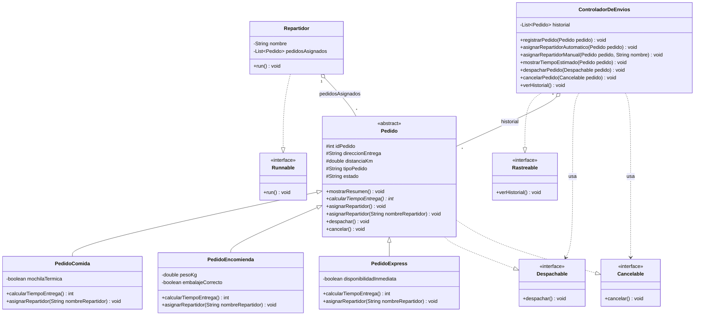
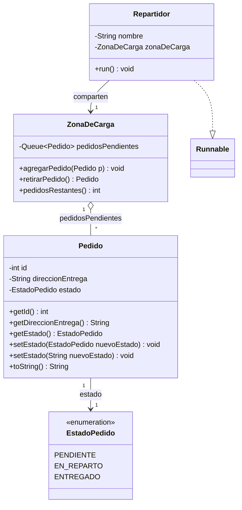

# Sistema de entregas SpeedFast

Proyecto en Java que simula el sistema de asignación, cálculo de tiempos, despacho,
cancelación, historial, entrega concurrente, sincronización de acceso a recursos compartidos,
interfaz gráfica de escritorio y persistencia en base de datos de **SpeedFast**, una empresa de
reparto a domicilio con tres tipos de servicio: comida, encomiendas y compras express. El
proyecto se desarrolla en ocho semanas, cada una incorporando un principio distinto de la
Programación Orientada a Objetos, la concurrencia, las interfaces gráficas y el acceso a datos.

- **Semana 1 — Sobrecarga y sobreescritura**: `asignarRepartidor()` se **sobrescribe** en cada
  subclase, y `asignarRepartidor(String nombreRepartidor)` es una versión **sobrecargada** (misma
  funcionalidad, distinta firma) que agrega la validación propia de cada tipo de pedido.
- **Semana 2 — Clase abstracta**: `Pedido` pasa a ser una clase **abstracta** que centraliza los
  atributos y el método `mostrarResumen()`, y declara el método abstracto
  `calcularTiempoEntrega()`, que cada subclase implementa con su propia fórmula.
- **Semana 3 — Interfaces**: se agregan las interfaces `Despachable`, `Cancelable` y
  `Rastreable` para desacoplar el despacho, la cancelación y el historial de la lógica interna
  de cada pedido, orquestadas por una nueva clase `ControladorDeEnvios`.
- **Semana 4 — Concurrencia**: se agrega la clase `Repartidor`, que implementa `Runnable` y
  entrega su lista de pedidos en un hilo independiente; `Main` ejecuta varios repartidores en
  paralelo con `ExecutorService`.
- **Semana 5 — Sincronización**: nuevo paquete `Sincronizacion`, autocontenido, donde varios
  `Repartidor` compiten por retirar pedidos de una `ZonaDeCarga` compartida usando métodos
  `synchronized`, garantizando que cada pedido se entregue una única vez.
- **Semana 6 — Interfaz gráfica**: nuevo paquete `Gui` con ventanas Swing (`VentanaPrincipal`,
  `VentanaRegistroPedido`, `VentanaListaPedidos`) que reutilizan el modelo y el
  `ControladorDeEnvios` de las semanas 1 a 4 para registrar, listar y asignar/despachar pedidos
  desde una aplicación de escritorio.
- **Semana 7 — JDBC**: nuevos paquetes `dao` y `modelo`; `ConexionDB` abre la conexión con
  `DriverManager`, y `PedidoDAO`/`RepartidorDAO`/`EntregaDAO` insertan y consultan datos en MySQL
  con `PreparedStatement`/`ResultSet`. Las ventanas de la semana 6 se modifican para leer y
  escribir directamente en la base de datos en vez de una lista en memoria.
- **Semana 8 — CRUD completo**: los DAO pasan a tener `create()/readAll()/update()/delete()` para
  repartidores, pedidos y entregas (esquema con tablas en plural y `ENUM`), y la interfaz se
  rehace como una ventana con una pestaña CRUD por entidad, con validaciones y filtros.

## Estructura del proyecto

Cada paquete agrupa una única responsabilidad: los pedidos, los contratos (interfaces) que
pueden cumplir, y el componente que orquesta el sistema.

```
src/
├── Main.java                       # Entrada de consola de la semana 5 (Sincronizacion)
├── main/
│   └── Main.java                   # Entrada de la app gráfica: new VentanaPrincipal()
├── Gui/
│   ├── VentanaPrincipal.java        # JFrame con una pestaña CRUD por entidad
│   ├── PanelCrud.java               # Base común: tabla, botones, validación y errores SQL
│   ├── PanelRepartidores.java       # CRUD de repartidores
│   ├── PanelPedidos.java            # CRUD de pedidos + filtros por estado/tipo
│   ├── PanelEntregas.java           # CRUD de entregas (combos de pedido/repartidor desde la BD)
│   └── Item.java                    # Elemento de combo: muestra "id - texto", conserva el id
├── dao/
│   ├── ConexionDB.java              # Abre la conexión JDBC con DriverManager
│   ├── PedidoDAO.java               # create() / readAll() / update() / delete()
│   ├── RepartidorDAO.java           # create() / readAll() / update() / delete()
│   └── EntregaDAO.java              # create() / readAll() / update() / delete()
├── modelo/
│   ├── Pedido.java                  # POJO plano: id, direccion, tipo, estado
│   ├── Repartidor.java              # POJO plano: id, nombre
│   └── Entrega.java                 # POJO plano: id, idPedido, idRepartidor, fecha, hora
├── Gestion_Pedidos/
│   ├── Pedido.java                 # Clase abstracta base (implementa Despachable, Cancelable)
│   ├── PedidoComida.java           # Valida mochila térmica
│   ├── PedidoEncomienda.java       # Valida peso y embalaje
│   └── PedidoExpress.java          # Valida cercanía y disponibilidad inmediata
├── Interfaces_Pedido/
│   ├── Despachable.java            # Interfaz: despachar()
│   ├── Cancelable.java             # Interfaz: cancelar()
│   └── Rastreable.java             # Interfaz: verHistorial()
├── Gestion_Envios/
│   └── ControladorDeEnvios.java    # Orquesta asignación, despacho, cancelación e historial
├── Concurrencia/
│   └── Repartidor.java             # Runnable: entrega su lista de pedidos en un hilo propio
└── Sincronizacion/                 # Ejercicio autocontenido de la semana 5 (no depende de lo anterior)
    ├── EstadoPedido.java           # enum: PENDIENTE, EN_REPARTO, ENTREGADO
    ├── Pedido.java                 # id, direccionEntrega, estado + toString()
    ├── ZonaDeCarga.java            # Recurso compartido: agregarPedido()/retirarPedido() synchronized
    └── Repartidor.java             # Runnable: compite por pedidos en la ZonaDeCarga compartida
```

> Nota: `Sincronizacion` define sus propias clases `Pedido` y `Repartidor`, independientes de
> `Gestion_Pedidos.Pedido` y `Concurrencia.Repartidor`. La actividad de la semana 5 pide una
> clase `Pedido` mínima (`id`, `direccionEntrega`, `estado`) enfocada en sincronización, distinta
> del `Pedido` abstracto y con reglas de negocio de las semanas 1-4; por eso vive en su propio
> paquete en vez de mezclarse con la jerarquía existente.

> Nota: `modelo.Pedido`/`modelo.Repartidor` son POJOs planos que reflejan exactamente las
> columnas de las tablas MySQL (la tabla `pedido` no tiene `distanciaKm` ni subtipos). Por eso
> son clases distintas de `Gestion_Pedidos.Pedido`. Desde la semana 7, las ventanas del paquete
> `Gui` usan estos POJOs + los `dao.*DAO` para persistir en MySQL; `Gestion_Pedidos` y
> `Gestion_Envios.ControladorDeEnvios` se conservan tal como quedaron en la semana 4 (siguen
> compilando y `Main.java` de la raíz los sigue usando), pero ya no están conectados a la GUI.

El conector JDBC (`lib/mysql-connector-j-8.4.0.jar`) y el script de creación de la base de
datos (`sql/speedfast_db.sql`) se incluyen en el repositorio; ver la sección
["Configuración de MySQL y del conector JDBC"](#configuración-de-mysql-y-del-conector-jdbc)
más abajo para los pasos de configuración.

## Diagrama de clases



## Jerarquía de clases

### `Pedido` (clase abstracta)

Atributos comunes a todo pedido:

| Atributo           | Tipo     | Descripción                                    |
|---------------------|----------|-------------------------------------------------|
| `idPedido`          | `int`    | Identificador del pedido                         |
| `direccionEntrega`  | `String` | Dirección donde se debe entregar                |
| `distanciaKm`       | `double` | Distancia a recorrer, usada para estimar el tiempo |
| `tipoPedido`        | `String` | Etiqueta del tipo de pedido (usada en los logs de asignación) |
| `estado`            | `String` | `Pendiente`, `Despachado` o `Cancelado`          |

Métodos:

```java
public void mostrarResumen()          // implementado: imprime id, dirección y distancia
public abstract int calcularTiempoEntrega(); // abstracto: cada subclase define su fórmula

public void asignarRepartidor()                       // sobrescrito por cada subclase
public void asignarRepartidor(String nombreRepartidor) // sobrecargado y sobrescrito

public void despachar()   // implementa Despachable
public void cancelar()    // implementa Cancelable
```

### `PedidoComida extends Pedido`

Agrega `mochilaTermica` (`boolean`).

- `calcularTiempoEntrega()`: **15 min + 2 min por cada km** (`15 + 2 * distanciaKm`).
- `asignarRepartidor(String)`: valida que el repartidor cuente con mochila térmica.

### `PedidoEncomienda extends Pedido`

Agrega `pesoKg` (`double`) y `embalajeCorrecto` (`boolean`).

- `calcularTiempoEntrega()`: **20 min + 1.5 min por km**, ajustado a entero
  (`Math.round(20 + 1.5 * distanciaKm)`).
- `asignarRepartidor(String)`: valida embalaje correcto y peso máximo de 20 kg.

### `PedidoExpress extends Pedido`

Agrega `disponibilidadInmediata` (`boolean`).

- `calcularTiempoEntrega()`: **10 min base**; si `distanciaKm > 5`, se suman **5 min extra**.
- `asignarRepartidor(String)`: valida cercanía/disponibilidad inmediata del repartidor.

## Semana 8: CRUD completo con JDBC + Swing

**Base de datos**: [`sql/speedfast_db.sql`](sql/speedfast_db.sql) crea `speedfast_db` con las
tablas `repartidores`, `pedidos` (`tipo` y `estado` son `ENUM`) y `entregas` (llaves foráneas
a las otras dos). Ejecútalo, y deja en [`src/dao/ConexionDB.java`](src/dao/ConexionDB.java) tu
contraseña de MySQL (ver "Configuración de MySQL" más abajo; el conector ya está en `lib/`).

**Capa `dao`** — `RepartidorDAO`, `PedidoDAO` y `EntregaDAO` exponen `create()`, `readAll()`,
`update()` y `delete()` con `PreparedStatement`/`ResultSet` y `try-with-resources` (cierra
conexión, statement y resultset aunque haya error). `PedidoDAO.readAll(estado, tipo)` y
`EntregaDAO.readAll(idPedido, idRepartidor)` aceptan filtros opcionales (`null` = sin filtrar)
resueltos en SQL con parámetros. Las excepciones `SQLException` suben hasta la vista.

**Capa `Gui`** — `VentanaPrincipal` es un `JFrame` con un `JTabbedPane`; cada pestaña es un
`JPanel` (`PanelRepartidores`, `PanelPedidos`, `PanelEntregas`) con formulario, `JTable` y
botones Guardar / Actualizar / Eliminar / Limpiar. Al hacer clic en una fila de la tabla, el
formulario se llena para editarla. `PanelCrud` concentra lo común: botones → operaciones DAO,
validación de entradas (campos obligatorios, largo máximo, formato de fecha `AAAA-MM-DD` y hora
`HH:mm[:ss]`) con mensajes `JOptionPane`, confirmación antes de eliminar, y mensajes claros ante
errores SQL (incluido el caso de borrar un pedido/repartidor que ya tiene entregas).
En `PanelEntregas`, pedido y repartidor se eligen en `JComboBox` cargados desde la BD que
muestran `id - texto` y conservan el id (`Item`); los combos y la tabla se recargan después de
cada operación y cada vez que se vuelve a esa pestaña, así reflejan altas/ediciones/bajas hechas
en las otras. Los filtros (pedidos por estado/tipo; entregas por pedido/repartidor) se aplican con
el botón **Filtrar**.

> Nota: la actividad pide una "ClienteDAO" en el Paso 2, pero el caso y el esquema solo tienen
> repartidores, pedidos y entregas; se implementó `RepartidorDAO`.

**Verificación**: los tres DAO (CRUD, filtros, fecha/hora, restricciones de llave foránea) y los
tres paneles (validaciones, selección de fila, combos, filtros, eliminación con confirmación) se
probaron contra un MySQL 8.4 real con un script de prueba temporal.

## Semana 7: persistencia con JDBC

Nuevos paquetes `dao` y `modelo`. El objetivo es que los formularios de la semana 6 dejen de
guardar los datos en memoria (`ControladorDeEnvios`) y pasen a leer/escribir directamente en
MySQL.

- **`modelo.Pedido` / `modelo.Repartidor` / `modelo.Entrega`**: POJOs planos que reflejan
  exactamente las columnas de las tablas `pedido`, `repartidor` y `entrega` (ver
  [`sql/speedfast_db.sql`](sql/speedfast_db.sql)). Cada uno tiene un constructor "para insertar"
  (sin `id`, ya que MySQL lo autogenera) y otro "para reconstruir" (con `id`, usado al leer filas
  de un `ResultSet`).

- **`dao.ConexionDB`**: abre la conexión con `DriverManager.getConnection(URL, USUARIO,
  PASSWORD)` contra `jdbc:mysql://localhost:3306/speedfast_db`, y expone un método estático
  `cerrar(AutoCloseable...)` que las tres clases DAO reutilizan en su bloque `finally` para
  cerrar `ResultSet`/`Statement`/`Connection` sin duplicar ese código tres veces.

- **`dao.PedidoDAO`**: `guardar(Pedido)` (INSERT con `PreparedStatement`, recupera el id
  autogenerado con `getGeneratedKeys()`), `listarTodos()` (SELECT, arma la lista recorriendo el
  `ResultSet`) y `actualizarEstado(int, String)` (UPDATE, usado al asignar un repartidor).

- **`dao.RepartidorDAO`**: `guardar(Repartidor)` y `listarTodos()`, mismo patrón.

- **`dao.EntregaDAO`**: `guardar(Entrega)` — inserta la fila que relaciona `id_pedido` +
  `id_repartidor` + `fecha` + `hora`, cumpliendo las llaves foráneas del modelo.

Cada método de cada DAO sigue el patrón pedido por la actividad: `try` con la operación JDBC,
`catch (SQLException e)` que registra el error y vuelve a lanzarlo (para que la ventana que lo
llamó pueda mostrarlo con `JOptionPane`), y `finally` que cierra los recursos abiertos pase lo
que pase. Se verificó (sin un MySQL disponible en este entorno) que al no poder conectar, la
excepción (`CommunicationsException`, subclase de `SQLException`) se captura y propaga
correctamente sin colgar la aplicación ni dejar recursos sin cerrar.

### Cambios en la interfaz gráfica de la semana 6

- **`VentanaRegistroPedido`**: ya no pide ID ni distancia (no existen en la tabla `pedido`); el
  formulario quedó en Dirección + Tipo (`JComboBox` con los valores literales `COMIDA` /
  `ENCOMIENDA` / `EXPRESS` de la columna `tipo`). Al guardar, crea un `modelo.Pedido` con estado
  inicial `PENDIENTE` y llama a `PedidoDAO.guardar(...)`.
- **`VentanaRegistroRepartidor`** (nueva): formulario mínimo (Nombre) que llama a
  `RepartidorDAO.guardar(...)`.
- **`VentanaListaPedidos`**: la tabla ahora tiene las columnas ID, Dirección, Tipo y Estado
  (las de la tabla `pedido`), poblada con `PedidoDAO.listarTodos()`; "Refrescar" vuelve a
  consultar la base de datos.
- **`VentanaPrincipal`**: agrega un cuarto botón, **Registrar repartidor**. El botón **Asignar
  repartidor / Iniciar entrega** ahora deja elegir un pedido `PENDIENTE` y un repartidor ya
  registrados en la base de datos (en vez de escribir el nombre a mano), y al confirmar llama a
  `EntregaDAO.guardar(...)` seguido de `PedidoDAO.actualizarEstado(id, "EN_REPARTO")`.

`Gestion_Pedidos`, `Interfaces_Pedido`, `Gestion_Envios` y `Concurrencia.Repartidor` (semanas
1-4) se dejan intactos — siguen compilando y el `Main.java` de la raíz los sigue usando para la
simulación de consola — pero ya no están conectados a la GUI, que ahora persiste en MySQL.

### Configuración de MySQL y del conector JDBC

1. Instala MySQL (o usa una instancia ya existente) y ejecuta
   [`sql/speedfast_db.sql`](sql/speedfast_db.sql) — crea la base `speedfast_db` y las tres
   tablas con sus llaves foráneas.
2. Edita [`src/dao/ConexionDB.java`](src/dao/ConexionDB.java) y reemplaza `PASSWORD` por la
   contraseña real de tu usuario `root` de MySQL (o cambia `USUARIO`/`URL` si usas otro usuario
   u otro puerto).
3. El conector `mysql-connector-j-8.4.0.jar` ya está en [`lib/`](lib) y registrado como librería
   del proyecto en `.idea/libraries/mysql_connector_j.xml` (agregado al módulo en el `.iml`), así
   que IntelliJ debería reconocerlo al abrir el proyecto. Si no aparece, agrégalo manualmente:
   **File → Project Structure → Libraries → + → Java** y selecciona ese `.jar`.
4. Ejecuta `main.Main` para abrir la aplicación gráfica.

> Desde la semana 8 el esquema usa tablas en plural y los DAO/ventanas de la semana 7 fueron
> reemplazados (ver arriba); esta sección describe cómo quedó esa semana.

## Semana 6: interfaz gráfica con Swing

Paquete `Gui`, que da a todo el sistema construido en las semanas 1-4 (jerarquía `Pedido`,
`ControladorDeEnvios`, interfaces, `Repartidor`) una **interfaz de escritorio** para operarlo
sin usar la consola.

- **`VentanaPrincipal`** (`JFrame`): ventana de navegación. Crea la única instancia de
  `ControladorDeEnvios` de la aplicación y la comparte con cada ventana hija que abre, para que
  todas trabajen sobre los mismos datos. Organiza tres botones con `BorderLayout` (título al
  norte) + `GridLayout(3,1)` (botones al centro):
  - **Registrar pedido** → abre `VentanaRegistroPedido`.
  - **Listar pedidos** → abre `VentanaListaPedidos`.
  - **Asignar repartidor / Iniciar entrega** → pide (con `JOptionPane`) elegir un pedido
    `Pendiente` y el nombre del repartidor, llama a `asignarRepartidorAutomatico()` /
    `asignarRepartidorManual()` (semana 1) y luego lanza un `Concurrencia.Repartidor` en un
    **hilo aparte** para no congelar la interfaz mientras se simula la entrega; al terminar,
    `SwingUtilities.invokeLater(...)` muestra la confirmación de forma segura desde el hilo de
    eventos de Swing.

- **`VentanaRegistroPedido`** (`JFrame`): formulario con ID, Dirección, Distancia (km) y un
  `JComboBox` de Tipo (Comida / Encomienda / Express). El botón **Guardar** valida los campos
  (ID numérico y único, dirección no vacía, distancia positiva), construye la subclase de
  `Pedido` correspondiente, la registra en el `ControladorDeEnvios` compartido y confirma con
  `JOptionPane`.

- **`VentanaListaPedidos`** (`JFrame`): una `JTable` respaldada por `DefaultTableModel`
  (ID, Dirección, Tipo, Distancia, Tiempo estimado, Estado), de solo lectura. El botón
  **Refrescar** vuelve a leer `controlador.obtenerPedidos()` y repuebla la tabla, para reflejar
  pedidos agregados o despachados después de abrirla.

La navegación entre ventanas y el dato compartido se resuelven pasando la misma referencia de
`ControladorDeEnvios` por constructor a cada ventana — el mismo patrón de desacoplamiento por
interfaces/controlador ya usado en la semana 3, ahora aplicado también a la capa visual.

### `main.Main`: punto de entrada de la aplicación gráfica

```java
package main;

public class Main {
    public static void main(String[] args) {
        SwingUtilities.invokeLater(VentanaPrincipal::new);
    }
}
```

`new VentanaPrincipal()` se ejecuta dentro de `invokeLater` para construir la interfaz en el
hilo de eventos de Swing (buena práctica estándar), tal como pide la actividad. El `Main.java`
de la raíz del proyecto (sin paquete) se conserva como punto de entrada de la simulación de
consola de la semana 5.

## Semana 5: sincronización con `ZonaDeCarga`

Paquete `Sincronizacion`, un ejercicio independiente centrado en **evitar condiciones de
carrera** cuando varios hilos acceden a un mismo recurso compartido.



- **`EstadoPedido`** (enum): `PENDIENTE`, `EN_REPARTO`, `ENTREGADO`. Reemplaza estados de texto
  libre por constantes verificadas en tiempo de compilación.
- **`Pedido`**: `id`, `direccionEntrega` y `estado` (tipado como `EstadoPedido`), con
  constructor, getters, `toString()` y **dos `setEstado()` sobrecargados** — uno que recibe el
  enum directamente y otro que recibe un `String` (`EstadoPedido.valueOf(...)`), tal como pide
  la actividad.
- **`ZonaDeCarga`**: recurso compartido entre todos los repartidores. Usa una `Queue<Pedido>`
  (`LinkedList`) protegida con los métodos `synchronized void agregarPedido(Pedido)` y
  `synchronized Pedido retirarPedido()`. Al ser `synchronized`, solo un hilo a la vez puede
  ejecutar cualquiera de los dos métodos sobre la misma instancia, así que dos repartidores
  **nunca** pueden retirar el mismo pedido — `retirarPedido()` es la única puerta de entrada a
  la cola, y `poll()` extrae y elimina en un solo paso atómico dentro de la sección crítica.
- **`Repartidor`**: implementa `Runnable` con `nombre` y una referencia a la `ZonaDeCarga`
  compartida (no una lista propia, a diferencia del `Repartidor` de la semana 4). En `run()`,
  repite en bucle: retira un pedido, lo pasa a `EN_REPARTO`, simula la entrega con
  `Thread.sleep()` (duración aleatoria de 1 a 3 segundos), y lo marca `ENTREGADO`. El bucle
  termina cuando `retirarPedido()` devuelve `null` (zona de carga vacía).

`Main` instancia una `ZonaDeCarga`, agrega 6 pedidos, y lanza 3 `Repartidor` mediante un
`ExecutorService` de tamaño fijo; espera con `shutdown()` + `awaitTermination()` a que los tres
vacíen la zona de carga antes de imprimir "Todos los pedidos han sido entregados
correctamente". Como los tres repartidores compiten por la misma cola (en vez de tener listas
fijas asignadas), el reparto de pedidos entre ellos varía en cada ejecución, pero el total
entregado siempre es igual a la cantidad de pedidos agregados — evidencia de que no hay
retiros duplicados ni pedidos perdidos.

## Semana 4: concurrencia con `Repartidor` y `ExecutorService`

Se agrega el paquete `Concurrencia` con la clase `Repartidor`, que simula a un repartidor
entregando su lista de pedidos en un **hilo independiente**:

- Implementa `Runnable`; su atributo `nombre` y su lista `pedidosAsignados` (`List<Pedido>`)
  se reciben por constructor.
- `run()` recorre los pedidos **secuencialmente** (un repartidor entrega uno a la vez), pero
  cada `Repartidor` corre en su propio hilo, por lo que varios repartidores entregan **en
  paralelo** entre sí.
- Por cada pedido: imprime el tiempo estimado (`calcularTiempoEntrega()`), simula la entrega
  con `Thread.sleep()` usando una duración aleatoria (1 a 3 segundos,
  `ThreadLocalRandom.nextInt(1000, 3001)`), y llama a `pedido.despachar()` (interfaz
  `Despachable`, reutilizada de la semana 3). Si el pedido ya fue cancelado, `despachar()` lo
  rechaza y `Repartidor` lo reporta en vez de marcarlo como entregado.

`Main` reutiliza toda la jerarquía y las interfaces previas: crea 6 pedidos (2 de cada tipo),
los registra en un `ControladorDeEnvios` (`Rastreable`), cancela uno de antemano para probar
la validación cruzada con `Cancelable`, y arma 3 repartidores con 2 pedidos cada uno.

La ejecución paralela se hace con `ExecutorService`:

```java
ExecutorService executor = Executors.newFixedThreadPool(3);
executor.submit(repartidor1);
executor.submit(repartidor2);
executor.submit(repartidor3);

executor.shutdown();
executor.awaitTermination(1, TimeUnit.MINUTES); // espera a que los 3 terminen
```

Como las esperas (`Thread.sleep`) son aleatorias, el orden de los mensajes en consola varía en
cada ejecución — evidencia visual de que los tres repartidores avanzan de forma simultánea e
independiente, y no uno después del otro.

## Semana 3: interfaces y `ControladorDeEnvios`

Se agregan tres interfaces en el paquete `Interfaces_Pedido`, cada una con una única
responsabilidad:

- **`Despachable`** → `despachar()`
- **`Cancelable`** → `cancelar()`
- **`Rastreable`** → `verHistorial()`

`Pedido` (en `Gestion_Pedidos`) implementa `Despachable` y `Cancelable`, ya que despachar o
cancelar es una operación propia de cada pedido individual (cambia su `estado` interno). Un
pedido ya `Despachado` no puede cancelarse, y uno `Cancelado` no puede despacharse.

`Rastreable`, en cambio, se implementa en `ControladorDeEnvios` (paquete `Gestion_Envios`),
porque el historial es una responsabilidad del sistema (que administra una lista de pedidos),
no de un pedido individual. Al vivir en su propio paquete, `ControladorDeEnvios` no depende de
los detalles internos de `Gestion_Pedidos`, solo de las interfaces que necesita.
`ControladorDeEnvios` mantiene internamente un `ArrayList<Pedido>` y expone:

- `registrarPedido(Pedido)` — agrega un pedido al historial.
- `asignarRepartidorAutomatico(Pedido)` / `asignarRepartidorManual(Pedido, String)` — delegan en
  las versiones sobrescrita y sobrecargada de `asignarRepartidor()`.
- `mostrarTiempoEstimado(Pedido)` — llama a `mostrarResumen()` y `calcularTiempoEntrega()`.
- `despacharPedido(Despachable)` / `cancelarPedido(Cancelable)` — reciben el **tipo interfaz**,
  no `Pedido`, por lo que el controlador no depende de la jerarquía concreta de pedidos.
- `verHistorial()` — imprime cada pedido registrado junto a su estado actual.

### Contribución a escalabilidad, reutilización y mantenibilidad

- **Escalabilidad**: agregar un nuevo tipo de servicio (por ejemplo, `PedidoProgramado`) solo
  requiere extender `Pedido` e implementar `calcularTiempoEntrega()` y
  `asignarRepartidor(String)`; el resto del sistema (`ControladorDeEnvios`, interfaces) no
  cambia.
- **Reutilización**: `ControladorDeEnvios` opera sobre `Despachable` y `Cancelable`, por lo que
  cualquier clase futura que implemente esas interfaces (no solo `Pedido`) puede reutilizar la
  misma lógica de despacho/cancelación sin modificar el controlador.
- **Mantenibilidad**: separar `verHistorial()` en una interfaz distinta a `Pedido` evita que la
  clase abstracta cargue con responsabilidades ajenas a un pedido individual; un cambio en cómo
  se presenta el historial afecta solo a `ControladorDeEnvios`, no a la jerarquía de pedidos.

## Semana 2: clase abstracta y `calcularTiempoEntrega()`

`Pedido` no puede instanciarse directamente (`abstract class`); solo sus subclases pueden
crearse, y cada una está obligada a implementar `calcularTiempoEntrega()` con su propia lógica.
`mostrarResumen()` sí está implementado en la clase base y es **heredado sin cambios** por las
tres subclases, reutilizando el nombre real de la clase (`getClass().getSimpleName()`) para
imprimir el encabezado:

```
PedidoComida #001

Dirección: Av. Italia 456
Distancia: 4 km
Tiempo estimado de entrega: 23 minutos
```

## Semana 1: sobrecarga y sobreescritura de `asignarRepartidor()`

1. `asignarRepartidor()` (sin argumentos) está **sobrescrito** en cada subclase e imprime el
   encabezado del pedido y el mensaje "Asignando repartidor...".
2. `asignarRepartidor(String nombreRepartidor)` está **sobrecargado** (misma clase, distinta
   firma) y además **sobrescrito** en cada subclase: ejecuta la validación propia del tipo de
   pedido y, si es válida, confirma la asignación con el nombre del repartidor.

```
[Pedido Comida]
Asignando repartidor...
→ Verificando mochila térmica... OK
→ Pedido asignado a Juan Pérez
```
